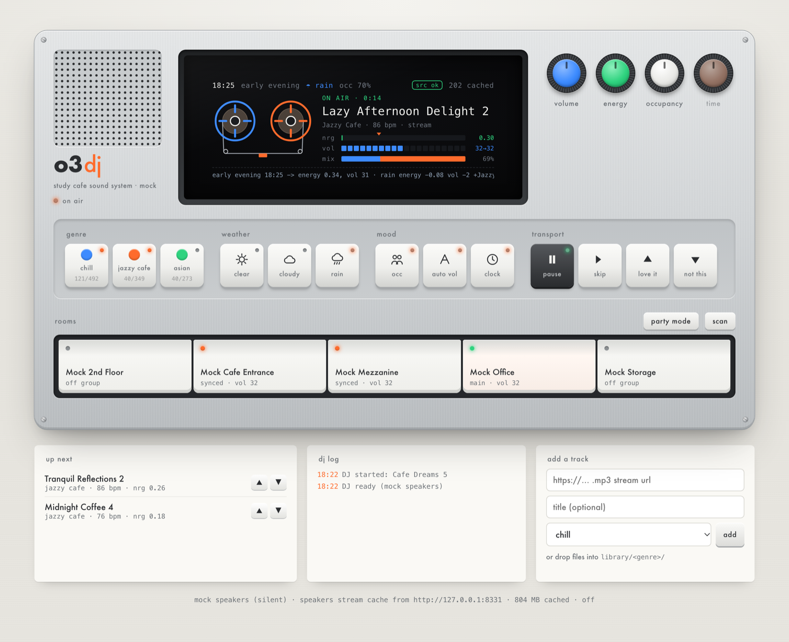

# O3 DJ

A live DJ for the O3 study cafes. It picks music to suit the room (time of day,
weather, how busy it is) and plays it on Sonos speakers. You drive it from a
small controller styled after the teenage engineering OP-1.



<sub>Mock mode, early evening with rain: the DJ is mixing chill with jazzy cafe (69% jazz) at low energy, two rooms synced.</sub>

This is the **test bench** version: atmosphere inputs are manual knobs and keys,
not yet wired to live data (clock aside). It runs on a laptop on the same Wi-Fi as the speakers.

```bash
pip3 install -r requirements.txt       # plus ffmpeg for tempo analysis: brew install ffmpeg
python3 run.py --mock                  # silent: simulated speakers, own state file, safe to play with
python3 run.py                         # real Sonos (main room IP in config.json)
```

Open http://localhost:8330. Anyone on the same Wi-Fi can use the address printed at startup.

**On a phone** (same Wi-Fi): open the printed address, e.g. `http://192.168.0.70:8330`, in Safari, then
Share → *Add to Home Screen* for an app-like icon. The phone layout puts play / skip / votes first. Drag a knob up or down
to turn it, and double-tap to reset it.

## The controller

| control | what it does |
|---|---|
| **blue knob** volume | in *auto vol*: trims the automatic level ±. With auto off: sets the volume directly. Double-click resets. |
| **green knob** energy | nudges how upbeat the picks are. Double-click resets. |
| **white knob** occupancy | sets how full the space is (turning it switches **occ** on). Above 50% the music gets slightly louder and more upbeat. |
| **orange knob** time | simulates a time of day so you can test evening vs afternoon. **clock** key returns to the real time. |

Knob trims (volume/energy) reset automatically when the real clock moves into the next part of the day.
| **genre** keys | chill / jazzy cafe / asian. You can pick several. The counts show cached/total tracks. |
| **weather** keys | cloudy leans jazzier; rain leans jazzier, softer and calmer, and brings jazz in even if not selected. |
| **play / skip** | play starts the DJ. **This replaces the main room's Sonos queue.** |
| **love it / not this** | votes. "not this" skips; 3 net downvotes remove a track from rotation. You can also vote on "up next". |
| **rooms** | tap a room to switch it on (join the synced group) or off. Switching off the **main** room hands the music to another room in the group, which becomes main; if it's the only room playing, the music pauses. |
| **main** (on each room) | makes that room the main room: it leads the group and holds the queue. The music carries on; a room that's off joins first. Remembered across restarts. |
| **room knob** (small blue, on each room) | that room's volume relative to the main volume: five detents from 9 o'clock to 3 o'clock (−10, −5, 0, +5, +10; `room_offset_steps` in `config.json`). Drag, scroll or arrow keys; double-click resets. Saved per room; starts from `room_volume_offsets`. |
| **mute** (slide switch, on each room) | mutes that room on the Sonos. It stays in the group, so unmuting is instant; a mute set in the Sonos app shows here too. |

The screen shows why the DJ is doing what it's doing: `early evening -> energy 0.42 · rain energy -0.08 +Jazzy Cafe`.
Energy marker ▼ = target, green bar = current track.

## Calibrating a venue (once, about 5 minutes)

It's one key, **calibrate** (next to the demo/live switch), and the screen shows everything else.

1. **Press calibrate.** The speakers play a short song (starting 45 s in) for the first of six scenarios: quiet morning,
   lunchtime rush, rainy afternoon, busy after work, winding down, and a rainy near-empty night. The screen shows the
   scenario (time, weather, how full), the song, the current volume and energy, and a key legend.
2. **Adjust by ear:** **blue knob** louder/softer, **green knob** faster/slower (a new song starts once you stop turning),
   **skip** for another song.
3. **Press calibrate** (now labelled *sounds right*) for the next scenario.
4. After the sixth, the screen shows what it learned in plain words: overall level, packed room, empty room, rain, cloud.
   **Press calibrate** (*apply*) to keep it, or **hold** it to discard.

Hold the key at any point to cancel (nothing changes). When not calibrating, holding it resets the venue to the defaults.
The result is saved for this venue in `data/calibration.json` on the DJ laptop, and the DJ goes back to normal.

The knobs still work day to day as temporary tweaks (they reset when the time of day moves on). Each venue also has a
`max_volume` safety cap in `config.json` (Newtown 75, others 60).

## Which venue am I in?

The DJ works it out on startup, from the **Sonos system** it's controlling (each venue's Sonos household has a unique, permanent
ID, listed under `venues.<code>.sonos_households` in `config.json`), falling back to the network's public IP. The startup log
prints `venue: Newtown (sydney_01, from sonos)`. For a new venue, run it once, copy the household ID from the "not identified"
message into `config.json`, and you're done. `live.venue` in `config.local.json` overrides detection.

## Demo and live mode

The **live data** key switches modes (details and setup: [docs/live-mode-plan.md](docs/live-mode-plan.md)).

- **Demo** (default): you set weather, occupancy and time of day with the keys and knobs.
- **Live**: time follows the venue clock, weather comes from Open-Meteo, and occupancy is read from O3's Supabase (read-only,
  no database changes). Pressing a weather key or turning the occupancy knob overrides live data for an hour; press the lit
  weather key again, or the occ key, to hand back early. If a feed goes quiet for 15 minutes the DJ ignores it (`stale`)
  rather than acting on old data.

Set it up in `config.local.json` (gitignored; copy `config.local.example.json`): the venue code, the O3 app's public key,
and an O3 app account for the DJ to sign in with. Occupancy comes from O3's existing `get_location_occupancy_counts` function,
and capacity from the venue's red threshold. Details: [docs/live-mode-plan.md](docs/live-mode-plan.md).

## How it decides

`o3dj/brain.py` is pure logic. Tune it in `config.json`:

- **daypart_curve**: energy + volume by hour (a 24h cafe: calm late night, peak in the afternoon, winding down in the evening).
- **weather**: energy/volume nudges and genre boosts.
- **occupancy**: threshold and max boost.
- **min_volume / max_volume**: hard safety limits. **room_volume_offsets**: starting per-room levels, e.g. `{"Cafe Entrance": 4}`; the knob on each room overrides them.

Picking: choose a genre by weight, then a track whose **energy** is close to the target,
weighted by votes, avoiding the last 60 plays. Energy comes from analysing
each track's audio (tempo, loudness, rhythm density, brightness; see `o3dj/analysis.py`),
and is ranked relative to the whole library. Chillify has no tempo metadata,
so analysis fills in in the background (~0.1 s per cached track; streaming
tracks are analysed from a 60 s range read). Unanalysed tracks can still be picked, just less often.

The DJ only keeps ~2 tracks queued ahead on the speaker. When you change the mood,
the upcoming picks are replaced within a couple of seconds and the current song plays out.

## Resilience

- **Patchy Wi-Fi**: upcoming tracks are downloaded ahead. When a track is cached, the speakers
  stream it from this laptop over the local network, so an internet drop mid-song doesn't cut out.
- **Source down**: 40 tracks per genre are kept warm in `data/cache/` (`cache.warm_per_genre`,
  capped by `cache.max_mb`). If chillify.me can't be reached, the DJ plays only cached/local tracks
  and switches back when it returns. The catalogue itself is snapshotted too.
- **A track won't play**: it's skipped; after two failures it's rested for an hour.
- **Someone plays Spotify on the speakers**: the DJ notices and stands down until you press play.
- **Paused/stopped from the Sonos app**: the DJ respects it and waits for play.
- **The DJ restarts**: it takes back its own queue and carries on, as long as the speaker is still playing it.
- **Queue safety**: the DJ never removes the playing track or the next one (the Sonos pre-loads it), so mood changes
  take effect from the track after next. If the speaker jumps back to an old track, it skips forward to new music instead of replaying.

The laptop has to stay on and awake (macOS: `caffeinate -i python3 run.py`), and
allow incoming connections if the firewall asks, so the speakers can fetch cached files.

## Adding music

See [library/README.md](library/README.md): drop files into `library/<genre>/`, paste stream URLs into
the "add a track" box, or write a new source class in `o3dj/library.py`.
Only play music O3 is licensed to use in a commercial venue.

## Layout

```
run.py              entry point (threads: dj loop, health check, prefetch/analysis; Flask server)
config.json         tuning; put machine-specific overrides in config.local.json (gitignored)
o3dj/brain.py       atmosphere -> targets, track picking (pure, tested)
o3dj/dj.py          rolling queue, volume ramps, votes, fallbacks
o3dj/player.py      SonosPlayer (SoCo) and MockPlayer
o3dj/library.py     sources: Chillify, library/ folders, custom URL list
o3dj/cache.py       download cache + background prefetch/analysis
o3dj/analysis.py    ffmpeg/numpy tempo & energy
o3dj/server.py      JSON API, UI, /media for speakers
web/                the controller (plain HTML/CSS/JS, no external assets)
data/               runtime state, cache, votes (gitignored)
```

API: `GET /api/state`, `POST /api/control {action: play|pause|skip|up|down, id?}`,
`POST /api/inputs {genres, weather, occupancy, occupancy_enabled, hour_override, auto, manual_volume, volume_trim, energy_trim}`,
`POST /api/speakers {action: party|join|leave|main|offset|mute|discover, ip?, value?}`, `POST /api/tracks {url, title, genre}`.
These are the hooks for live data later: a weather or occupancy feed only needs to POST to `/api/inputs`.

## Not yet

- No login: anyone on the Wi-Fi can open the controller. Fine for testing; add auth before staff use.
- Live feeds (weather API, door counter / booking occupancy) aren't connected yet.
- Energy estimates are heuristic; votes gradually correct them.

Tests: `python3 -m pytest -q`
